# 📊 Activity Diagrams - Sistem Kesiswaan SMK14

## 📋 Daftar Isi
1. [Autentikasi & Login](#1-autentikasi--login)
2. [Manajemen User](#2-manajemen-user)
3. [Manajemen Pelanggaran](#3-manajemen-pelanggaran)
4. [Manajemen Prestasi](#4-manajemen-prestasi)
5. [Sistem Tindakan Otomatis](#5-sistem-tindakan-otomatis)
6. [Proses Kenaikan Kelas](#6-proses-kenaikan-kelas)
7. [Sistem Laporan & Statistik](#7-sistem-laporan--statistik)
8. [Dashboard & Notifikasi](#8-dashboard--notifikasi)
9. [Import & Export Data](#9-import--export-data)
10. [Sistem Automasi](#10-sistem-automasi)

---

## 1. Autentikasi & Login

### 1.1 Activity Diagram: Proses Login Multi-Role

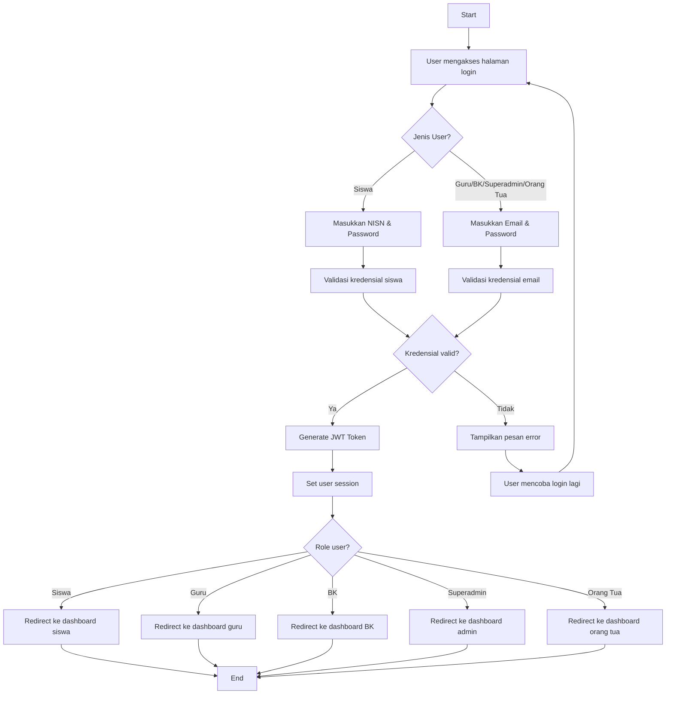
```mermaid
graph TD
    A[Start] --> B[User mengakses halaman login]
    B --> C{Jenis User?}
    
    C -->|Siswa| D[Masukkan NISN & Password]
    C -->|Guru/BK/Superadmin/Orang Tua| E[Masukkan Email & Password]
    
    D --> F[Validasi kredensial siswa]
    E --> G[Validasi kredensial email]
    
    F --> H{Kredensial valid?}
    G --> H
    
    H -->|Ya| I[Generate JWT Token]
    H -->|Tidak| J[Tampilkan pesan error]
    
    I --> K[Set user session]
    K --> L{Role user?}
    
    L -->|Siswa| M[Redirect ke dashboard siswa]
    L -->|Guru| N[Redirect ke dashboard guru]
    L -->|BK| O[Redirect ke dashboard BK]
    L -->|Superadmin| P[Redirect ke dashboard admin]
    L -->|Orang Tua| Q[Redirect ke dashboard orang tua]
    
    M --> R[End]
    N --> R
    O --> R
    P --> R
    Q --> R
    
    J --> S[User mencoba login lagi]
    S --> B
```

### 1.2 Penjelasan Proses Login:
- **Siswa**: Login menggunakan NISN sebagai username
- **Guru/BK/Superadmin/Orang Tua**: Login menggunakan email
- **Password default**: Berbeda per role
- **JWT Token**: Digunakan untuk autentikasi session
- **Role-based redirect**: Setiap role diarahkan ke dashboard yang sesuai

---

## 2. Manajemen User

### 2.1 Activity Diagram: CRUD Siswa

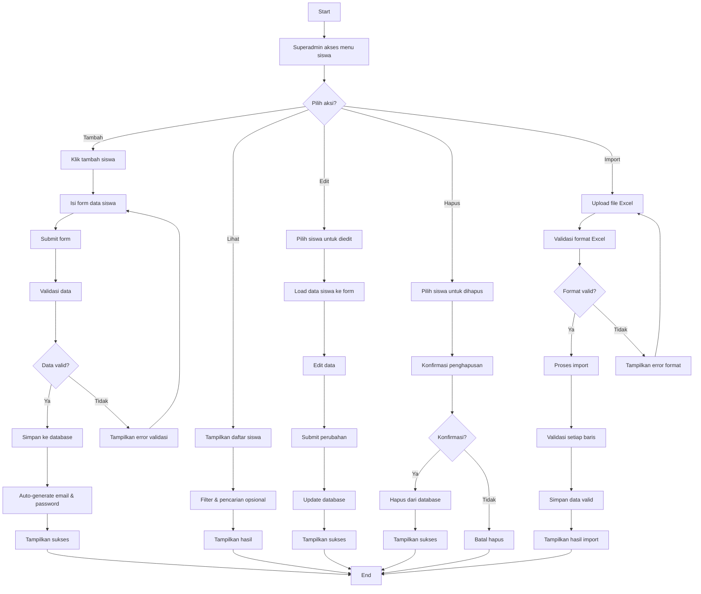
```mermaid
graph TD
    A[Start] --> B[Superadmin akses menu siswa]
    B --> C{Pilih aksi?}
    
    C -->|Tambah| D[Klik tambah siswa]
    C -->|Lihat| E[Tampilkan daftar siswa]
    C -->|Edit| F[Pilih siswa untuk diedit]
    C -->|Hapus| G[Pilih siswa untuk dihapus]
    C -->|Import| H[Upload file Excel]
    
    D --> I[Isi form data siswa]
    I --> J[Submit form]
    J --> K[Validasi data]
    K --> L{Data valid?}
    L -->|Ya| M[Simpan ke database]
    L -->|Tidak| N[Tampilkan error validasi]
    M --> O[Auto-generate email & password]
    O --> P[Tampilkan sukses]
    
    E --> Q[Filter & pencarian opsional]
    Q --> R[Tampilkan hasil]
    
    F --> S[Load data siswa ke form]
    S --> T[Edit data]
    T --> U[Submit perubahan]
    U --> V[Update database]
    V --> W[Tampilkan sukses]
    
    G --> X[Konfirmasi penghapusan]
    X --> Y{Konfirmasi?}
    Y -->|Ya| Z[Hapus dari database]
    Y -->|Tidak| AA[Batal hapus]
    Z --> BB[Tampilkan sukses]
    
    H --> CC[Validasi format Excel]
    CC --> DD{Format valid?}
    DD -->|Ya| EE[Proses import]
    DD -->|Tidak| FF[Tampilkan error format]
    EE --> GG[Validasi setiap baris]
    GG --> HH[Simpan data valid]
    HH --> II[Tampilkan hasil import]
    
    P --> JJ[End]
    R --> JJ
    W --> JJ
    BB --> JJ
    AA --> JJ
    II --> JJ
    N --> I
    FF --> H
```

### 2.2 Activity Diagram: CRUD Guru

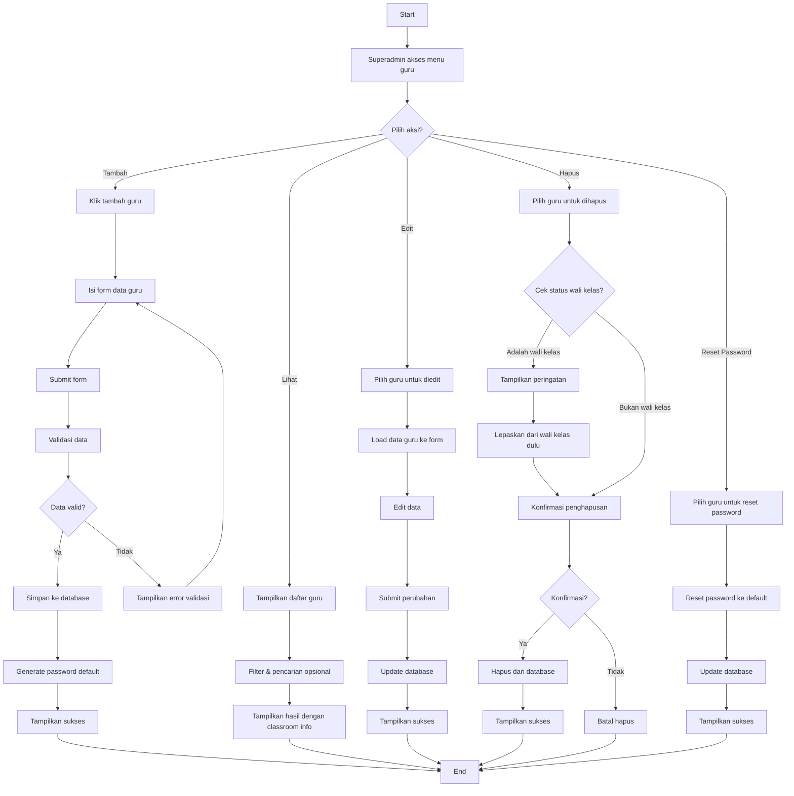
```mermaid
graph TD
    A[Start] --> B[Superadmin akses menu guru]
    B --> C{Pilih aksi?}
    
    C -->|Tambah| D[Klik tambah guru]
    C -->|Lihat| E[Tampilkan daftar guru]
    C -->|Edit| F[Pilih guru untuk diedit]
    C -->|Hapus| G[Pilih guru untuk dihapus]
    C -->|Reset Password| H[Pilih guru untuk reset password]
    
    D --> I[Isi form data guru]
    I --> J[Submit form]
    J --> K[Validasi data]
    K --> L{Data valid?}
    L -->|Ya| M[Simpan ke database]
    L -->|Tidak| N[Tampilkan error validasi]
    M --> O[Generate password default]
    O --> P[Tampilkan sukses]
    
    E --> Q[Filter & pencarian opsional]
    Q --> R[Tampilkan hasil dengan classroom info]
    
    F --> S[Load data guru ke form]
    S --> T[Edit data]
    T --> U[Submit perubahan]
    U --> V[Update database]
    V --> W[Tampilkan sukses]
    
    G --> X{Cek status wali kelas?}
    X -->|Adalah wali kelas| Y[Tampilkan peringatan]
    X -->|Bukan wali kelas| Z[Konfirmasi penghapusan]
    Y --> AA[Lepaskan dari wali kelas dulu]
    AA --> Z
    Z --> BB{Konfirmasi?}
    BB -->|Ya| CC[Hapus dari database]
    BB -->|Tidak| DD[Batal hapus]
    CC --> EE[Tampilkan sukses]
    
    H --> FF[Reset password ke default]
    FF --> GG[Update database]
    GG --> HH[Tampilkan sukses]
    
    P --> II[End]
    R --> II
    W --> II
    EE --> II
    DD --> II
    HH --> II
    N --> I
```

### 2.3 Activity Diagram: Manajemen Kelas & Wali Kelas

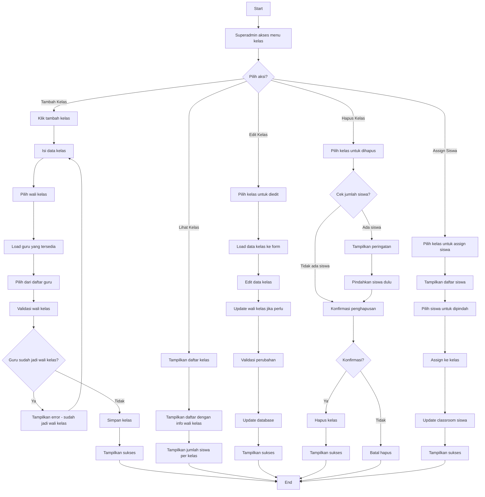
```mermaid
graph TD
    A[Start] --> B[Superadmin akses menu kelas]
    B --> C{Pilih aksi?}
    
    C -->|Tambah Kelas| D[Klik tambah kelas]
    C -->|Lihat Kelas| E[Tampilkan daftar kelas]
    C -->|Edit Kelas| F[Pilih kelas untuk diedit]
    C -->|Hapus Kelas| G[Pilih kelas untuk dihapus]
    C -->|Assign Siswa| H[Pilih kelas untuk assign siswa]
    
    D --> I[Isi data kelas]
    I --> J[Pilih wali kelas]
    J --> K[Load guru yang tersedia]
    K --> L[Pilih dari daftar guru]
    L --> M[Validasi wali kelas]
    M --> N{Guru sudah jadi wali kelas?}
    N -->|Ya| O[Tampilkan error - sudah jadi wali kelas]
    N -->|Tidak| P[Simpan kelas]
    P --> Q[Tampilkan sukses]
    
    E --> R[Tampilkan daftar dengan info wali kelas]
    R --> S[Tampilkan jumlah siswa per kelas]
    
    F --> T[Load data kelas ke form]
    T --> U[Edit data kelas]
    U --> V[Update wali kelas jika perlu]
    V --> W[Validasi perubahan]
    W --> X[Update database]
    X --> Y[Tampilkan sukses]
    
    G --> Z{Cek jumlah siswa?}
    Z -->|Ada siswa| AA[Tampilkan peringatan]
    Z -->|Tidak ada siswa| BB[Konfirmasi penghapusan]
    AA --> CC[Pindahkan siswa dulu]
    CC --> BB
    BB --> DD{Konfirmasi?}
    DD -->|Ya| EE[Hapus kelas]
    DD -->|Tidak| FF[Batal hapus]
    EE --> GG[Tampilkan sukses]
    
    H --> HH[Tampilkan daftar siswa]
    HH --> II[Pilih siswa untuk dipindah]
    II --> JJ[Assign ke kelas]
    JJ --> KK[Update classroom siswa]
    KK --> LL[Tampilkan sukses]
    
    Q --> MM[End]
    S --> MM
    Y --> MM
    GG --> MM
    FF --> MM
    LL --> MM
    O --> I
```

---

## 3. Manajemen Pelanggaran

### 3.1 Activity Diagram: CRUD Jenis Pelanggaran

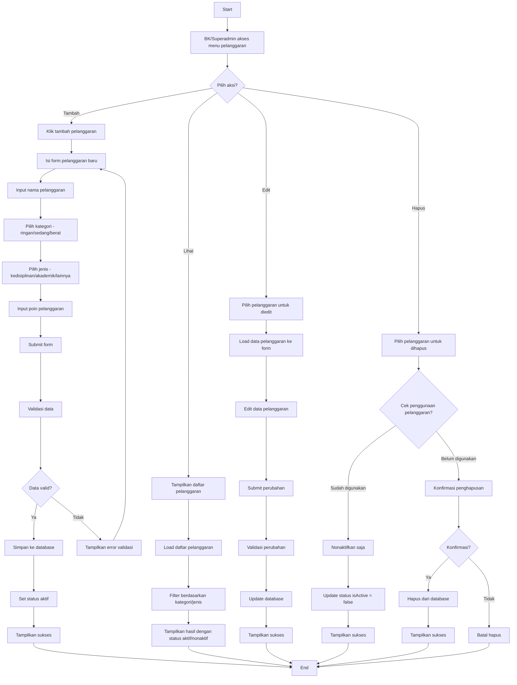
```mermaid
graph TD
    A[Start] --> B[BK/Superadmin akses menu pelanggaran]
    B --> C{Pilih aksi?}
    
    C -->|Tambah| D[Klik tambah pelanggaran]
    C -->|Lihat| E[Tampilkan daftar pelanggaran]
    C -->|Edit| F[Pilih pelanggaran untuk diedit]
    C -->|Hapus| G[Pilih pelanggaran untuk dihapus]
    
    D --> H[Isi form pelanggaran baru]
    H --> I[Input nama pelanggaran]
    I --> J[Pilih kategori - ringan/sedang/berat]
    J --> K[Pilih jenis - kedisiplinan/akademik/lainnya]
    K --> L[Input poin pelanggaran]
    L --> M[Submit form]
    M --> N[Validasi data]
    N --> O{Data valid?}
    O -->|Ya| P[Simpan ke database]
    O -->|Tidak| Q[Tampilkan error validasi]
    P --> R[Set status aktif]
    R --> S[Tampilkan sukses]
    
    E --> T[Load daftar pelanggaran]
    T --> U[Filter berdasarkan kategori/jenis]
    U --> V[Tampilkan hasil dengan status aktif/nonaktif]
    
    F --> W[Load data pelanggaran ke form]
    W --> X[Edit data pelanggaran]
    X --> Y[Submit perubahan]
    Y --> Z[Validasi perubahan]
    Z --> AA[Update database]
    AA --> BB[Tampilkan sukses]
    
    G --> CC{Cek penggunaan pelanggaran?}
    CC -->|Sudah digunakan| DD[Nonaktifkan saja]
    CC -->|Belum digunakan| EE[Konfirmasi penghapusan]
    DD --> FF[Update status isActive = false]
    FF --> GG[Tampilkan sukses]
    EE --> HH{Konfirmasi?}
    HH -->|Ya| II[Hapus dari database]
    HH -->|Tidak| JJ[Batal hapus]
    II --> KK[Tampilkan sukses]
    
    S --> LL[End]
    V --> LL
    BB --> LL
    GG --> LL
    KK --> LL
    JJ --> LL
    Q --> H
```

### 3.2 Activity Diagram: Laporan Pelanggaran Siswa

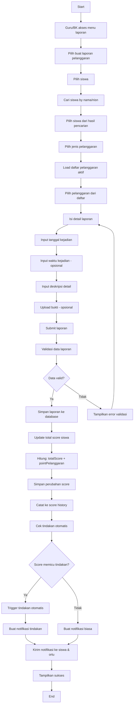
```mermaid
graph TD
    A[Start] --> B[Guru/BK akses menu laporan]
    B --> C[Pilih buat laporan pelanggaran]
    C --> D[Pilih siswa]
    D --> E[Cari siswa by nama/nisn]
    E --> F[Pilih siswa dari hasil pencarian]
    F --> G[Pilih jenis pelanggaran]
    G --> H[Load daftar pelanggaran aktif]
    H --> I[Pilih pelanggaran dari daftar]
    I --> J[Isi detail laporan]
    J --> K[Input tanggal kejadian]
    K --> L[Input waktu kejadian - opsional]
    L --> M[Input deskripsi detail]
    M --> N[Upload bukti - opsional]
    N --> O[Submit laporan]
    O --> P[Validasi data laporan]
    P --> Q{Data valid?}
    Q -->|Ya| R[Simpan laporan ke database]
    Q -->|Tidak| S[Tampilkan error validasi]
    R --> T[Update total score siswa]
    T --> U[Hitung: totalScore + pointPelanggaran]
    U --> V[Simpan perubahan score]
    V --> W[Catat ke score history]
    W --> X[Cek tindakan otomatis]
    X --> Y{Score memicu tindakan?}
    Y -->|Ya| Z[Trigger tindakan otomatis]
    Y -->|Tidak| AA[Buat notifikasi biasa]
    Z --> BB[Buat notifikasi tindakan]
    BB --> CC[Kirim notifikasi ke siswa & ortu]
    AA --> CC
    CC --> DD[Tampilkan sukses]
    
    DD --> EE[End]
    S --> J
```

### 3.3 Activity Diagram: Update & Delete Laporan Pelanggaran

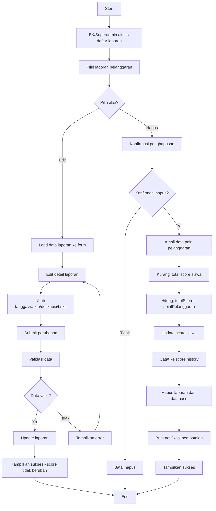
```mermaid
graph TD
    A[Start] --> B[BK/Superadmin akses daftar laporan]
    B --> C[Pilih laporan pelanggaran]
    C --> D{Pilih aksi?}
    
    D -->|Edit| E[Load data laporan ke form]
    D -->|Hapus| F[Konfirmasi penghapusan]
    
    E --> G[Edit detail laporan]
    G --> H[Ubah tanggal/waktu/deskripsi/bukti]
    H --> I[Submit perubahan]
    I --> J[Validasi data]
    J --> K{Data valid?}
    K -->|Ya| L[Update laporan]
    K -->|Tidak| M[Tampilkan error]
    L --> N[Tampilkan sukses - score tidak berubah]
    
    F --> O{Konfirmasi hapus?}
    O -->|Ya| P[Ambil data poin pelanggaran]
    O -->|Tidak| Q[Batal hapus]
    P --> R[Kurangi total score siswa]
    R --> S[Hitung: totalScore - pointPelanggaran]
    S --> T[Update score siswa]
    T --> U[Catat ke score history]
    U --> V[Hapus laporan dari database]
    V --> W[Buat notifikasi pembatalan]
    W --> X[Tampilkan sukses]
    
    N --> Y[End]
    Q --> Y
    X --> Y
    M --> G
```

---

## 4. Manajemen Prestasi

### 4.1 Activity Diagram: CRUD Jenis Prestasi

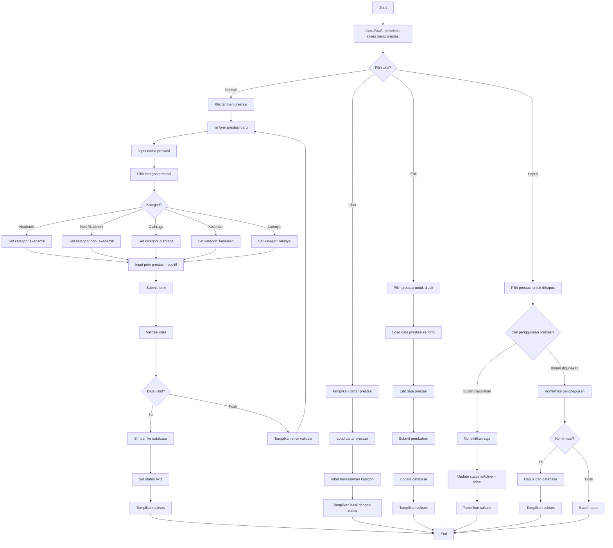
```mermaid
graph TD
    A[Start] --> B[Guru/BK/Superadmin akses menu prestasi]
    B --> C{Pilih aksi?}
    
    C -->|Tambah| D[Klik tambah prestasi]
    C -->|Lihat| E[Tampilkan daftar prestasi]
    C -->|Edit| F[Pilih prestasi untuk diedit]
    C -->|Hapus| G[Pilih prestasi untuk dihapus]
    
    D --> H[Isi form prestasi baru]
    H --> I[Input nama prestasi]
    I --> J[Pilih kategori prestasi]
    J --> K{Kategori?}
    K -->|Akademik| L[Set kategori: akademik]
    K -->|Non Akademik| M[Set kategori: non_akademik]
    K -->|Olahraga| N[Set kategori: olahraga]
    K -->|Kesenian| O[Set kategori: kesenian]
    K -->|Lainnya| P[Set kategori: lainnya]
    
    L --> Q[Input poin prestasi - positif]
    M --> Q
    N --> Q
    O --> Q
    P --> Q
    
    Q --> R[Submit form]
    R --> S[Validasi data]
    S --> T{Data valid?}
    T -->|Ya| U[Simpan ke database]
    T -->|Tidak| V[Tampilkan error validasi]
    U --> W[Set status aktif]
    W --> X[Tampilkan sukses]
    
    E --> Y[Load daftar prestasi]
    Y --> Z[Filter berdasarkan kategori]
    Z --> AA[Tampilkan hasil dengan status]
    
    F --> BB[Load data prestasi ke form]
    BB --> CC[Edit data prestasi]
    CC --> DD[Submit perubahan]
    DD --> EE[Update database]
    EE --> FF[Tampilkan sukses]
    
    G --> GG{Cek penggunaan prestasi?}
    GG -->|Sudah digunakan| HH[Nonaktifkan saja]
    GG -->|Belum digunakan| II[Konfirmasi penghapusan]
    HH --> JJ[Update status isActive = false]
    JJ --> KK[Tampilkan sukses]
    II --> LL{Konfirmasi?}
    LL -->|Ya| MM[Hapus dari database]
    LL -->|Tidak| NN[Batal hapus]
    MM --> OO[Tampilkan sukses]
    
    X --> PP[End]
    AA --> PP
    FF --> PP
    KK --> PP
    OO --> PP
    NN --> PP
    V --> H
```

### 4.2 Activity Diagram: Laporan Prestasi Siswa

```mermaid
graph TD
    A[Start] --> B[Guru/BK akses menu laporan prestasi]
    B --> C[Pilih buat laporan prestasi]
    C --> D[Pilih siswa]
    D --> E[Cari siswa by nama/nisn]
    E --> F[Pilih siswa dari hasil pencarian]
    F --> G[Pilih jenis prestasi]
    G --> H[Load daftar prestasi aktif]
    H --> I[Filter berdasarkan kategori]
    I --> J[Pilih prestasi dari daftar]
    J --> K[Isi detail laporan prestasi]
    K --> L[Input tanggal prestasi]
    L --> M[Input waktu - opsional]
    M --> N[Input deskripsi detail prestasi]
    N --> O[Upload bukti sertifikat/foto]
    O --> P[Submit laporan]
    P --> Q[Validasi data laporan]
    Q --> R{Data valid?}
    R -->|Ya| S[Simpan laporan ke database]
    R -->|Tidak| T[Tampilkan error validasi]
    S --> U[Update total score siswa]
    U --> V[Hitung: max(0, totalScore - pointPrestasi)]
    V --> W[Simpan perubahan score]
    W --> X[Catat ke score history]
    X --> Y[Buat notifikasi prestasi]
    Y --> Z[Kirim notifikasi ke siswa & ortu]
    Z --> AA[Tampilkan sukses dengan pengurang poin]
    
    AA --> BB[End]
    T --> K
```

---

## 5. Sistem Tindakan Otomatis

### 5.1 Activity Diagram: Konfigurasi Tindakan Otomatis

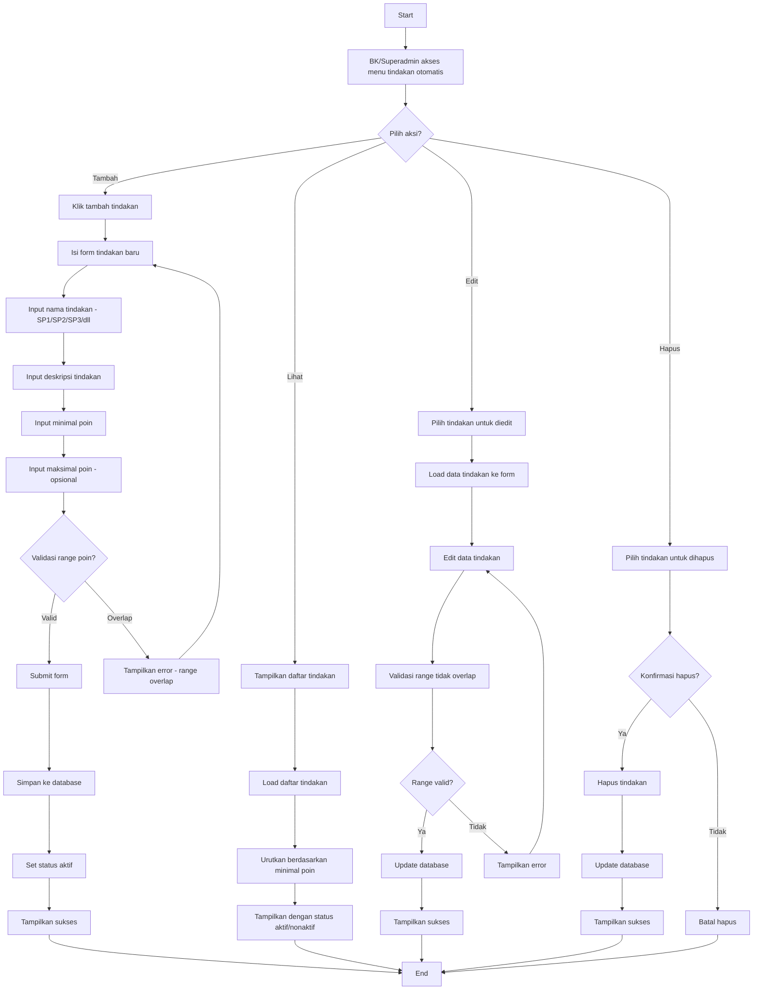
```mermaid
graph TD
    A[Start] --> B[BK/Superadmin akses menu tindakan otomatis]
    B --> C{Pilih aksi?}
    
    C -->|Tambah| D[Klik tambah tindakan]
    C -->|Lihat| E[Tampilkan daftar tindakan]
    C -->|Edit| F[Pilih tindakan untuk diedit]
    C -->|Hapus| G[Pilih tindakan untuk dihapus]
    
    D --> H[Isi form tindakan baru]
    H --> I[Input nama tindakan - SP1/SP2/SP3/dll]
    I --> J[Input deskripsi tindakan]
    J --> K[Input minimal poin]
    K --> L[Input maksimal poin - opsional]
    L --> M{Validasi range poin?}
    M -->|Overlap| N[Tampilkan error - range overlap]
    M -->|Valid| O[Submit form]
    O --> P[Simpan ke database]
    P --> Q[Set status aktif]
    Q --> R[Tampilkan sukses]
    
    E --> S[Load daftar tindakan]
    S --> T[Urutkan berdasarkan minimal poin]
    T --> U[Tampilkan dengan status aktif/nonaktif]
    
    F --> V[Load data tindakan ke form]
    V --> W[Edit data tindakan]
    W --> X[Validasi range tidak overlap]
    X --> Y{Range valid?}
    Y -->|Ya| Z[Update database]
    Y -->|Tidak| AA[Tampilkan error]
    Z --> BB[Tampilkan sukses]
    
    G --> CC{Konfirmasi hapus?}
    CC -->|Ya| DD[Hapus tindakan]
    CC -->|Tidak| EE[Batal hapus]
    DD --> FF[Update database]
    FF --> GG[Tampilkan sukses]
    
    R --> HH[End]
    U --> HH
    BB --> HH
    GG --> HH
    EE --> HH
    N --> H
    AA --> W
```

### 5.2 Activity Diagram: Proses Trigger Tindakan Otomatis

```mermaid
graph TD
    A[Siswa mendapat pelanggaran] --> B[Update total score siswa]
    B --> C[Score baru tersimpan]
    C --> D[Cek tindakan otomatis]
    D --> E[Query daftar tindakan aktif]
    E --> F[Loop setiap tindakan]
    F --> G{Score >= minPoint?}
    G -->|Tidak| H[Lanjut tindakan berikutnya]
    G -->|Ya| I{maxPoint ada?}
    I -->|Ya| J{Score <= maxPoint?}
    I -->|Tidak| K[Tindakan ini yang dipicu]
    J -->|Ya| K
    J -->|Tidak| H
    
    H --> L{Ada tindakan lain?}
    L -->|Ya| F
    L -->|Tidak| M[Tidak ada tindakan]
    
    K --> N[Buat record tindakan otomatis]
    N --> O[Insert ke tabel StudentAction]
    O --> P[Buat notifikasi khusus]
    P --> Q[Set jenis: "tindakan_otomatis"]
    Q --> R[Kirim notifikasi ke siswa]
    R --> S[Kirim notifikasi ke orang tua]
    S --> T{Tindakan = "Panggil Orang Tua"?}
    T -->|Ya| U[Kirim notifikasi khusus ke ortu]
    T -->|Tidak| V[Lanjut proses]
    U --> W[Buat jadwal panggilan]
    W --> V
    V --> X{Tindakan = "Drop Out"?}
    X -->|Ya| Y[Set flag siswa untuk review]
    X -->|Tidak| Z[Proses selesai]
    Y --> AA[Notifikasi ke BK untuk tindakan lanjut]
    AA --> Z
    
    M --> Z
    Z --> BB[End]
```

### 5.3 Activity Diagram: Monitoring Siswa dengan Tindakan

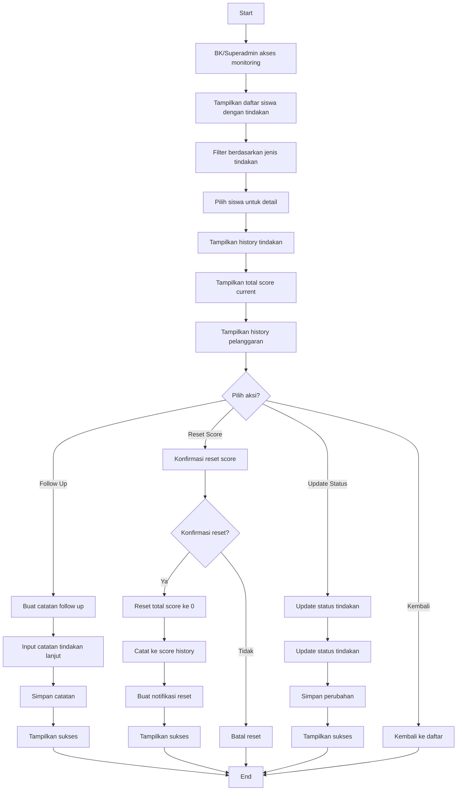
```mermaid
graph TD
    A[Start] --> B[BK/Superadmin akses monitoring]
    B --> C[Tampilkan daftar siswa dengan tindakan]
    C --> D[Filter berdasarkan jenis tindakan]
    D --> E[Pilih siswa untuk detail]
    E --> F[Tampilkan history tindakan]
    F --> G[Tampilkan total score current]
    G --> H[Tampilkan history pelanggaran]
    H --> I{Pilih aksi?}
    
    I -->|Follow Up| J[Buat catatan follow up]
    I -->|Reset Score| K[Konfirmasi reset score]
    I -->|Update Status| L[Update status tindakan]
    I -->|Kembali| M[Kembali ke daftar]
    
    J --> N[Input catatan tindakan lanjut]
    N --> O[Simpan catatan]
    O --> P[Tampilkan sukses]
    
    K --> Q{Konfirmasi reset?}
    Q -->|Ya| R[Reset total score ke 0]
    Q -->|Tidak| S[Batal reset]
    R --> T[Catat ke score history]
    T --> U[Buat notifikasi reset]
    U --> V[Tampilkan sukses]
    
    L --> W[Update status tindakan]
    W --> X[Simpan perubahan]
    X --> Y[Tampilkan sukses]
    
    P --> Z[End]
    V --> Z
    Y --> Z
    S --> Z
    M --> Z
```

---

## 6. Proses Kenaikan Kelas

### 6.1 Activity Diagram: Generate Kenaikan Kelas

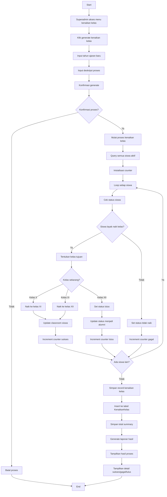
```mermaid
graph TD
    A[Start] --> B[Superadmin akses menu kenaikan kelas]
    B --> C[Klik generate kenaikan kelas]
    C --> D[Input tahun ajaran baru]
    D --> E[Input deskripsi proses]
    E --> F[Konfirmasi generate]
    F --> G{Konfirmasi proses?}
    G -->|Tidak| H[Batal proses]
    G -->|Ya| I[Mulai proses kenaikan kelas]
    
    I --> J[Query semua siswa aktif]
    J --> K[Inisialisasi counter]
    K --> L[Loop setiap siswa]
    L --> M[Cek status siswa]
    M --> N{Siswa layak naik kelas?}
    
    N -->|Ya| O[Tentukan kelas tujuan]
    N -->|Tidak| P[Set status tidak naik]
    
    O --> Q{Kelas sekarang?}
    Q -->|Kelas X| R[Naik ke kelas XI]
    Q -->|Kelas XI| S[Naik ke kelas XII]
    Q -->|Kelas XII| T[Set status lulus]
    
    R --> U[Update classroom siswa]
    S --> U
    T --> V[Update status menjadi alumni]
    
    U --> W[Increment counter sukses]
    P --> X[Increment counter gagal]
    V --> Y[Increment counter lulus]
    
    W --> Z{Ada siswa lain?}
    X --> Z
    Y --> Z
    
    Z -->|Ya| L
    Z -->|Tidak| AA[Simpan record kenaikan kelas]
    
    AA --> BB[Insert ke tabel KenaikanKelas]
    BB --> CC[Simpan total summary]
    CC --> DD[Generate laporan hasil]
    DD --> EE[Tampilkan hasil proses]
    EE --> FF[Tampilkan detail sukses/gagal/lulus]
    
    H --> GG[End]
    FF --> GG
```

### 6.2 Activity Diagram: History & Monitoring Kenaikan Kelas

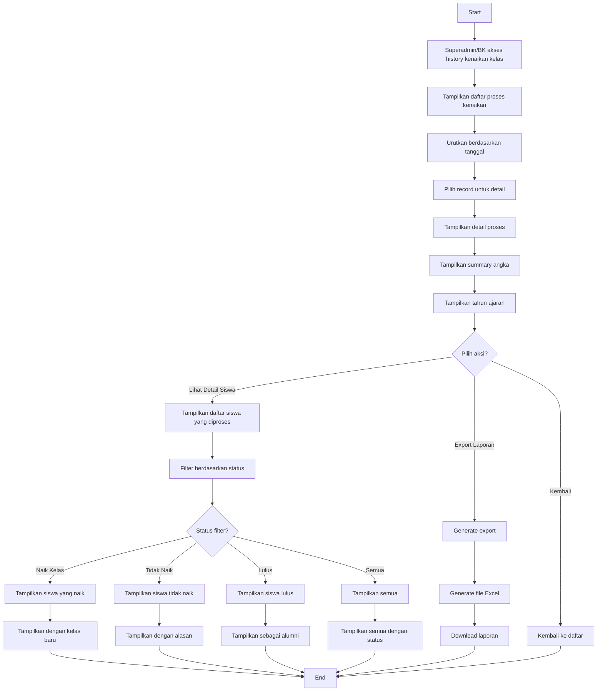
```mermaid
graph TD
    A[Start] --> B[Superadmin/BK akses history kenaikan kelas]
    B --> C[Tampilkan daftar proses kenaikan]
    C --> D[Urutkan berdasarkan tanggal]
    D --> E[Pilih record untuk detail]
    E --> F[Tampilkan detail proses]
    F --> G[Tampilkan summary angka]
    G --> H[Tampilkan tahun ajaran]
    H --> I{Pilih aksi?}
    
    I -->|Lihat Detail Siswa| J[Tampilkan daftar siswa yang diproses]
    I -->|Export Laporan| K[Generate export]
    I -->|Kembali| L[Kembali ke daftar]
    
    J --> M[Filter berdasarkan status]
    M --> N{Status filter?}
    N -->|Naik Kelas| O[Tampilkan siswa yang naik]
    N -->|Tidak Naik| P[Tampilkan siswa tidak naik]
    N -->|Lulus| Q[Tampilkan siswa lulus]
    N -->|Semua| R[Tampilkan semua]
    
    O --> S[Tampilkan dengan kelas baru]
    P --> T[Tampilkan dengan alasan]
    Q --> U[Tampilkan sebagai alumni]
    R --> V[Tampilkan semua dengan status]
    
    K --> W[Generate file Excel]
    W --> X[Download laporan]
    
    S --> Y[End]
    T --> Y
    U --> Y
    V --> Y
    X --> Y
    L --> Y
```

---

## 7. Sistem Laporan & Statistik

### 7.1 Activity Diagram: Laporan Statistik Pelanggaran

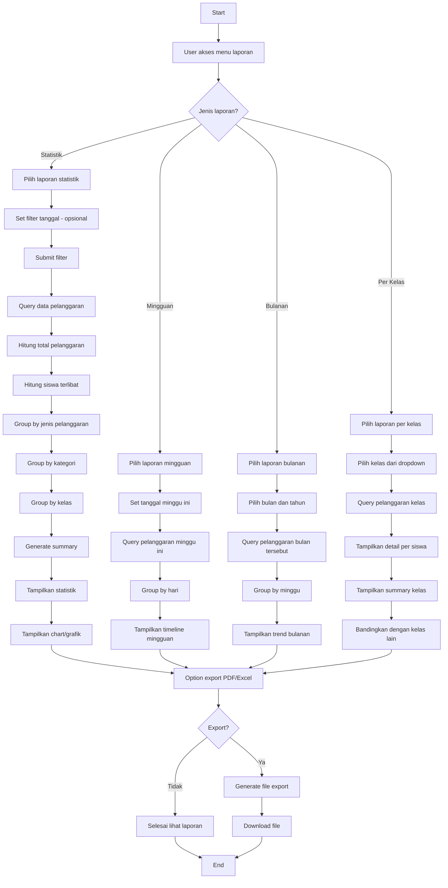
```mermaid
graph TD
    A[Start] --> B[User akses menu laporan]
    B --> C{Jenis laporan?}
    
    C -->|Statistik| D[Pilih laporan statistik]
    C -->|Mingguan| E[Pilih laporan mingguan]
    C -->|Bulanan| F[Pilih laporan bulanan]
    C -->|Per Kelas| G[Pilih laporan per kelas]
    
    D --> H[Set filter tanggal - opsional]
    H --> I[Submit filter]
    I --> J[Query data pelanggaran]
    J --> K[Hitung total pelanggaran]
    K --> L[Hitung siswa terlibat]
    L --> M[Group by jenis pelanggaran]
    M --> N[Group by kategori]
    N --> O[Group by kelas]
    O --> P[Generate summary]
    P --> Q[Tampilkan statistik]
    Q --> R[Tampilkan chart/grafik]
    
    E --> S[Set tanggal minggu ini]
    S --> T[Query pelanggaran minggu ini]
    T --> U[Group by hari]
    U --> V[Tampilkan timeline mingguan]
    
    F --> W[Pilih bulan dan tahun]
    W --> X[Query pelanggaran bulan tersebut]
    X --> Y[Group by minggu]
    Y --> Z[Tampilkan trend bulanan]
    
    G --> AA[Pilih kelas dari dropdown]
    AA --> BB[Query pelanggaran kelas]
    BB --> CC[Tampilkan detail per siswa]
    CC --> DD[Tampilkan summary kelas]
    DD --> EE[Bandingkan dengan kelas lain]
    
    R --> FF[Option export PDF/Excel]
    V --> FF
    Z --> FF
    EE --> FF
    
    FF --> GG{Export?}
    GG -->|Ya| HH[Generate file export]
    GG -->|Tidak| II[Selesai lihat laporan]
    
    HH --> JJ[Download file]
    
    II --> KK[End]
    JJ --> KK
```

### 7.2 Activity Diagram: Rekap Siswa Bermasalah

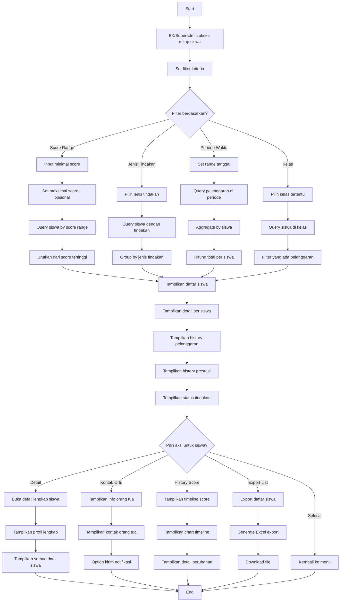
```mermaid
graph TD
    A[Start] --> B[BK/Superadmin akses rekap siswa]
    B --> C[Set filter kriteria]
    C --> D{Filter berdasarkan?}
    
    D -->|Score Range| E[Input minimal score]
    D -->|Jenis Tindakan| F[Pilih jenis tindakan]
    D -->|Periode Waktu| G[Set range tanggal]
    D -->|Kelas| H[Pilih kelas tertentu]
    
    E --> I[Set maksimal score - opsional]
    I --> J[Query siswa by score range]
    J --> K[Urutkan dari score tertinggi]
    
    F --> L[Query siswa dengan tindakan]
    L --> M[Group by jenis tindakan]
    
    G --> N[Query pelanggaran di periode]
    N --> O[Aggregate by siswa]
    O --> P[Hitung total per siswa]
    
    H --> Q[Query siswa di kelas]
    Q --> R[Filter yang ada pelanggaran]
    
    K --> S[Tampilkan daftar siswa]
    M --> S
    P --> S
    R --> S
    
    S --> T[Tampilkan detail per siswa]
    T --> U[Tampilkan history pelanggaran]
    U --> V[Tampilkan history prestasi]
    V --> W[Tampilkan status tindakan]
    W --> X{Pilih aksi untuk siswa?}
    
    X -->|Detail| Y[Buka detail lengkap siswa]
    X -->|Kontak Ortu| Z[Tampilkan info orang tua]
    X -->|History Score| AA[Tampilkan timeline score]
    X -->|Export List| BB[Export daftar siswa]
    X -->|Selesai| CC[Kembali ke menu]
    
    Y --> DD[Tampilkan profil lengkap]
    DD --> EE[Tampilkan semua data siswa]
    
    Z --> FF[Tampilkan kontak orang tua]
    FF --> GG[Option kirim notifikasi]
    
    AA --> HH[Tampilkan chart timeline]
    HH --> II[Tampilkan detail perubahan]
    
    BB --> JJ[Generate Excel export]
    JJ --> KK[Download file]
    
    EE --> LL[End]
    GG --> LL
    II --> LL
    KK --> LL
    CC --> LL
```

---

## 8. Dashboard & Notifikasi

### 8.1 Activity Diagram: Dashboard Siswa

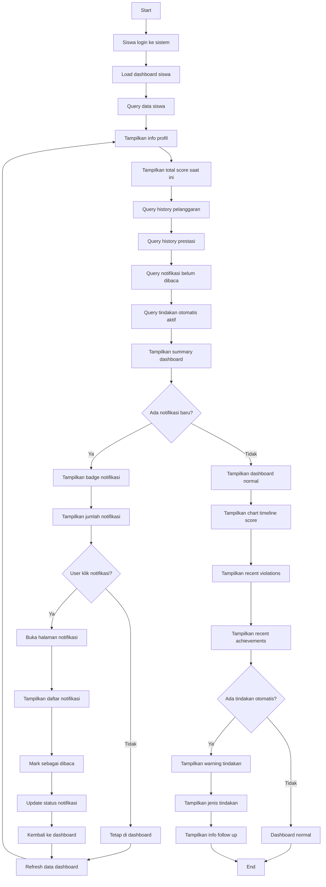
```mermaid
graph TD
    A[Start] --> B[Siswa login ke sistem]
    B --> C[Load dashboard siswa]
    C --> D[Query data siswa]
    D --> E[Tampilkan info profil]
    E --> F[Tampilkan total score saat ini]
    F --> G[Query history pelanggaran]
    G --> H[Query history prestasi]
    H --> I[Query notifikasi belum dibaca]
    I --> J[Query tindakan otomatis aktif]
    J --> K[Tampilkan summary dashboard]
    K --> L{Ada notifikasi baru?}
    L -->|Ya| M[Tampilkan badge notifikasi]
    L -->|Tidak| N[Tampilkan dashboard normal]
    
    M --> O[Tampilkan jumlah notifikasi]
    O --> P{User klik notifikasi?}
    P -->|Ya| Q[Buka halaman notifikasi]
    P -->|Tidak| R[Tetap di dashboard]
    
    Q --> S[Tampilkan daftar notifikasi]
    S --> T[Mark sebagai dibaca]
    T --> U[Update status notifikasi]
    
    N --> V[Tampilkan chart timeline score]
    V --> W[Tampilkan recent violations]
    W --> X[Tampilkan recent achievements]
    X --> Y{Ada tindakan otomatis?}
    Y -->|Ya| Z[Tampilkan warning tindakan]
    Y -->|Tidak| AA[Dashboard normal]
    
    Z --> BB[Tampilkan jenis tindakan]
    BB --> CC[Tampilkan info follow up]
    
    R --> DD[Refresh data dashboard]
    DD --> E
    
    U --> EE[Kembali ke dashboard]
    EE --> DD
    
    AA --> FF[End]
    CC --> FF
```

### 8.2 Activity Diagram: Dashboard Orang Tua

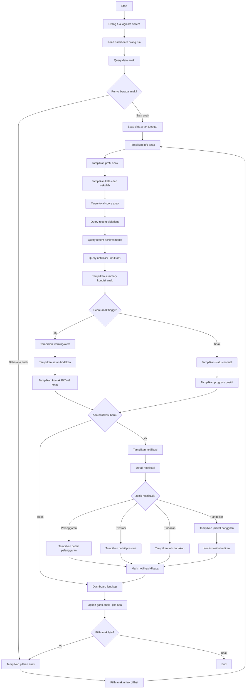
```mermaid
graph TD
    A[Start] --> B[Orang tua login ke sistem]
    B --> C[Load dashboard orang tua]
    C --> D[Query data anak]
    D --> E{Punya berapa anak?}
    E -->|Satu anak| F[Load data anak tunggal]
    E -->|Beberapa anak| G[Tampilkan pilihan anak]
    
    F --> H[Tampilkan info anak]
    
    G --> I[Pilih anak untuk dilihat]
    I --> H
    
    H --> J[Tampilkan profil anak]
    J --> K[Tampilkan kelas dan sekolah]
    K --> L[Query total score anak]
    L --> M[Query recent violations]
    M --> N[Query recent achievements]
    N --> O[Query notifikasi untuk ortu]
    O --> P[Tampilkan summary kondisi anak]
    P --> Q{Score anak tinggi?}
    Q -->|Ya| R[Tampilkan warning/alert]
    Q -->|Tidak| S[Tampilkan status normal]
    
    R --> T[Tampilkan saran tindakan]
    T --> U[Tampilkan kontak BK/wali kelas]
    
    S --> V[Tampilkan progress positif]
    
    U --> W{Ada notifikasi baru?}
    V --> W
    W -->|Ya| X[Tampilkan notifikasi]
    W -->|Tidak| Y[Dashboard lengkap]
    
    X --> Z[Detail notifikasi]
    Z --> AA{Jenis notifikasi?}
    AA -->|Pelanggaran| BB[Tampilkan detail pelanggaran]
    AA -->|Prestasi| CC[Tampilkan detail prestasi]
    AA -->|Tindakan| DD[Tampilkan info tindakan]
    AA -->|Panggilan| EE[Tampilkan jadwal panggilan]
    
    BB --> FF[Mark notifikasi dibaca]
    CC --> FF
    DD --> FF
    EE --> GG[Konfirmasi kehadiran]
    GG --> FF
    
    FF --> Y
    Y --> HH[Option ganti anak - jika ada]
    HH --> II{Pilih anak lain?}
    II -->|Ya| G
    II -->|Tidak| JJ[End]
```

### 8.3 Activity Diagram: Sistem Notifikasi Otomatis

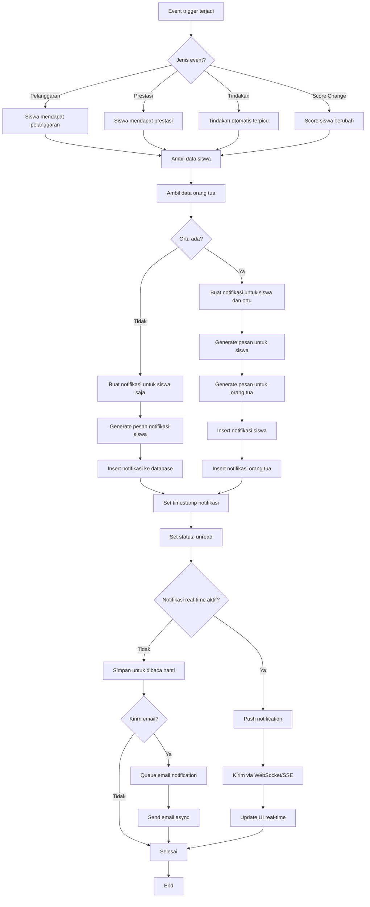
```mermaid
graph TD
    A[Event trigger terjadi] --> B{Jenis event?}
    
    B -->|Pelanggaran| C[Siswa mendapat pelanggaran]
    B -->|Prestasi| D[Siswa mendapat prestasi]
    B -->|Tindakan| E[Tindakan otomatis terpicu]
    B -->|Score Change| F[Score siswa berubah]
    
    C --> G[Ambil data siswa]
    D --> G
    E --> G
    F --> G
    
    G --> H[Ambil data orang tua]
    H --> I{Ortu ada?}
    I -->|Tidak| J[Buat notifikasi untuk siswa saja]
    I -->|Ya| K[Buat notifikasi untuk siswa dan ortu]
    
    J --> L[Generate pesan notifikasi siswa]
    K --> M[Generate pesan untuk siswa]
    M --> N[Generate pesan untuk orang tua]
    
    L --> O[Insert notifikasi ke database]
    N --> P[Insert notifikasi siswa]
    P --> Q[Insert notifikasi orang tua]
    
    O --> R[Set timestamp notifikasi]
    Q --> R
    R --> S[Set status: unread]
    S --> T{Notifikasi real-time aktif?}
    T -->|Ya| U[Push notification]
    T -->|Tidak| V[Simpan untuk dibaca nanti]
    
    U --> W[Kirim via WebSocket/SSE]
    W --> X[Update UI real-time]
    
    V --> Y{Kirim email?}
    Y -->|Ya| Z[Queue email notification]
    Y -->|Tidak| AA[Selesai]
    
    Z --> BB[Send email async]
    BB --> AA
    X --> AA
    AA --> CC[End]
```

---

## 9. Import & Export Data

### 9.1 Activity Diagram: Import Data dari Excel

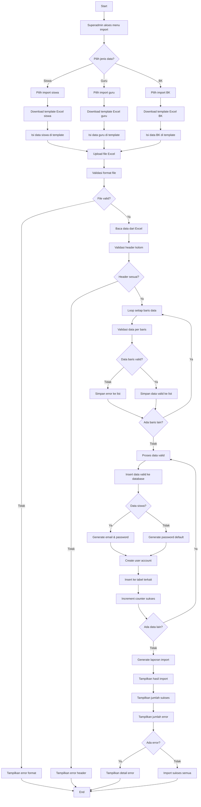
```mermaid
graph TD
    A[Start] --> B[Superadmin akses menu import]
    B --> C{Pilih jenis data?}
    
    C -->|Siswa| D[Pilih import siswa]
    C -->|Guru| E[Pilih import guru]
    C -->|BK| F[Pilih import BK]
    
    D --> G[Download template Excel siswa]
    E --> H[Download template Excel guru]
    F --> I[Download template Excel BK]
    
    G --> J[Isi data siswa di template]
    H --> K[Isi data guru di template]
    I --> L[Isi data BK di template]
    
    J --> M[Upload file Excel]
    K --> M
    L --> M
    
    M --> N[Validasi format file]
    N --> O{File valid?}
    O -->|Tidak| P[Tampilkan error format]
    O -->|Ya| Q[Baca data dari Excel]
    
    Q --> R[Validasi header kolom]
    R --> S{Header sesuai?}
    S -->|Tidak| T[Tampilkan error header]
    S -->|Ya| U[Loop setiap baris data]
    
    U --> V[Validasi data per baris]
    V --> W{Data baris valid?}
    W -->|Tidak| X[Simpan error ke list]
    W -->|Ya| Y[Simpan data valid ke list]
    
    X --> Z{Ada baris lain?}
    Y --> Z
    Z -->|Ya| U
    Z -->|Tidak| AA[Proses data valid]
    
    AA --> BB[Insert data valid ke database]
    BB --> CC{Data siswa?}
    CC -->|Ya| DD[Generate email & password]
    CC -->|Tidak| EE[Generate password default]
    
    DD --> FF[Create user account]
    EE --> FF
    FF --> GG[Insert ke tabel terkait]
    GG --> HH[Increment counter sukses]
    HH --> II{Ada data lain?}
    II -->|Ya| AA
    II -->|Tidak| JJ[Generate laporan import]
    
    JJ --> KK[Tampilkan hasil import]
    KK --> LL[Tampilkan jumlah sukses]
    LL --> MM[Tampilkan jumlah error]
    MM --> NN{Ada error?}
    NN -->|Ya| OO[Tampilkan detail error]
    NN -->|Tidak| PP[Import sukses semua]
    
    P --> QQ[End]
    T --> QQ
    OO --> QQ
    PP --> QQ
```

### 9.2 Activity Diagram: Export Data ke Excel

```mermaid
graph TD
    A[Start] --> B[User akses menu export]
    B --> C{Pilih jenis export?}
    
    C -->|Siswa| D[Export data siswa]
    C -->|Laporan Pelanggaran| E[Export laporan pelanggaran]
    C -->|Laporan Prestasi| F[Export laporan prestasi]
    C -->|Statistik| G[Export statistik]
    
    D --> H[Set filter siswa - opsional]
    H --> I{Filter berdasarkan?}
    I -->|Kelas| J[Pilih kelas]
    I -->|Angkatan| K[Pilih angkatan]
    I -->|Semua| L[Export semua siswa]
    
    E --> M[Set filter laporan pelanggaran]
    M --> N[Pilih range tanggal]
    N --> O[Pilih jenis pelanggaran - opsional]
    
    F --> P[Set filter laporan prestasi]
    P --> Q[Pilih range tanggal]
    Q --> R[Pilih kategori prestasi - opsional]
    
    G --> S[Pilih jenis statistik]
    S --> T[Set parameter statistik]
    
    J --> U[Query siswa by kelas]
    K --> V[Query siswa by angkatan]
    L --> W[Query semua siswa aktif]
    O --> X[Query pelanggaran by filter]
    R --> Y[Query prestasi by filter]
    T --> Z[Generate data statistik]
    
    U --> AA[Prepare data siswa]
    V --> AA
    W --> AA
    X --> BB[Prepare data pelanggaran]
    Y --> CC[Prepare data prestasi]
    Z --> DD[Prepare data statistik]
    
    AA --> EE[Format data untuk Excel]
    BB --> EE
    CC --> EE
    DD --> EE
    
    EE --> FF[Create Excel workbook]
    FF --> GG[Add worksheets]
    GG --> HH[Insert headers]
    HH --> II[Insert data rows]
    II --> JJ[Apply formatting]
    JJ --> KK[Add summary - jika perlu]
    KK --> LL[Save Excel file]
    LL --> MM[Generate download link]
    MM --> NN[Trigger download]
    NN --> OO[Cleanup temp file]
    
    OO --> PP[End]
```

---

## 10. Sistem Automasi

### 10.1 Activity Diagram: Automasi Cron Job Surat Peringatan

```mermaid
graph TD
    A[Cron job dimulai - setiap hari] --> B[Load konfigurasi automasi]
    B --> C{Automasi aktif?}
    C -->|Tidak| D[Skip proses]
    C -->|Ya| E[Query siswa dengan score tinggi]
    
    E --> F[Filter siswa yang belum dapat surat hari ini]
    F --> G{Ada siswa yang perlu surat?}
    G -->|Tidak| H[Log: tidak ada yang perlu surat]
    G -->|Ya| I[Loop setiap siswa]
    
    I --> J[Cek score siswa]
    J --> K{Score >= threshold surat peringatan?}
    K -->|Tidak| L[Skip siswa ini]
    K -->|Ya| M[Cek tindakan otomatis terkait]
    
    M --> N{Sudah dapat surat peringatan?}
    N -->|Ya| O[Cek interval kirim ulang]
    N -->|Tidak| P[Generate surat peringatan]
    
    O --> Q{Sudah waktunya kirim ulang?}
    Q -->|Tidak| L
    Q -->|Ya| P
    
    P --> R[Create record AutomasiSurat]
    R --> S[Generate content surat]
    S --> T[Insert ke database]
    T --> U[Kirim notifikasi ke siswa]
    U --> V[Kirim notifikasi ke orang tua]
    V --> W{Kirim email automatis?}
    W -->|Ya| X[Queue email surat peringatan]
    W -->|Tidak| Y[Simpan record saja]
    
    X --> Z[Send email async]
    Z --> Y
    
    Y --> L
    L --> AA{Ada siswa lain?}
    AA -->|Ya| I
    AA -->|Tidak| BB[Log summary proses]
    
    BB --> CC[Update last run timestamp]
    CC --> DD[Cleanup old records]
    DD --> EE[End cron job]
    
    D --> EE
    H --> EE
```

### 10.2 Activity Diagram: Automasi Delete Students Lama

```mermaid
graph TD
    A[Cron job dimulai - bulanan] --> B[Load konfigurasi retention]
    B --> C{Auto cleanup aktif?}
    C -->|Tidak| D[Skip proses]
    C -->|Ya| E[Hitung tanggal cutoff]
    
    E --> F[Cutoff = today - retention_months]
    F --> G[Query siswa lulus sebelum cutoff]
    G --> H{Ada siswa untuk cleanup?}
    H -->|Tidak| I[Log: tidak ada yang perlu cleanup]
    H -->|Ya| J[Loop setiap siswa lulus]
    
    J --> K[Backup data siswa]
    K --> L[Insert ke tabel ArchiveStudent]
    L --> M[Backup history pelanggaran]
    M --> N[Insert ke tabel ArchiveViolation]
    N --> O[Backup history prestasi]
    O --> P[Insert ke tabel ArchiveAchievement]
    P --> Q[Backup score history]
    Q --> R[Insert ke tabel ArchiveScoreHistory]
    R --> S{Backup berhasil?}
    S -->|Tidak| T[Log error, skip delete]
    S -->|Ya| U[Delete from StudentViolation]
    
    U --> V[Delete from StudentAchievement]
    V --> W[Delete from ScoreHistory]
    W --> X[Delete from Notification]
    X --> Y[Delete from Student]
    Y --> Z[Delete from User]
    Z --> AA[Log successful cleanup]
    
    T --> BB{Ada siswa lain?}
    AA --> BB
    BB -->|Ya| J
    BB -->|Tidak| CC[Generate cleanup report]
    
    CC --> DD[Count total archived]
    DD --> EE[Count total deleted]
    EE --> FF[Log summary report]
    FF --> GG[Send report ke admin]
    GG --> HH[Update last cleanup timestamp]
    
    D --> II[End]
    I --> II
    HH --> II
```

### 10.3 Activity Diagram: Auto Recalculate Scores

```mermaid
graph TD
    A[Trigger recalculate - manual/scheduled] --> B[Load semua siswa aktif]
    B --> C[Inisialisasi counter]
    C --> D[Loop setiap siswa]
    D --> E[Reset total score = 0]
    E --> F[Query semua pelanggaran siswa]
    F --> G[Loop setiap pelanggaran]
    G --> H[Tambah point pelanggaran ke total]
    H --> I{Ada pelanggaran lain?}
    I -->|Ya| G
    I -->|Tidak| J[Query semua prestasi siswa]
    
    J --> K[Loop setiap prestasi]
    K --> L[Kurangi point prestasi dari total]
    L --> M[Ensure total >= 0]
    M --> N{Ada prestasi lain?}
    N -->|Ya| K
    N -->|Tidak| O[Hitung total score final]
    
    O --> P{Score berbeda dari database?}
    P -->|Tidak| Q[Skip update]
    P -->|Ya| R[Update total score siswa]
    
    R --> S[Catat ke score history]
    S --> T[Log: "Recalculated score"]
    T --> U[Increment counter updated]
    
    Q --> V[Increment counter checked]
    
    U --> W{Ada siswa lain?}
    V --> W
    W -->|Ya| D
    W -->|Tidak| X[Generate recalculate report]
    
    X --> Y[Log total students checked]
    Y --> Z[Log total students updated]
    Z --> AA[Log time taken]
    AA --> BB[Send completion notification]
    
    BB --> CC[End]
```

---

## 📋 Summary Activity Diagrams

### Rangkuman Fitur dan Activity Diagrams:

#### 🔐 **Autentikasi & Manajemen User**
1. **Login Multi-Role**: Berbeda untuk siswa (NISN) vs lainnya (email)
2. **CRUD Siswa**: Dengan auto-generate email dan password
3. **CRUD Guru**: Dengan validasi wali kelas constraint
4. **Manajemen Kelas**: Assign wali kelas dan siswa

#### ⚠️ **Sistem Pelanggaran**
5. **CRUD Jenis Pelanggaran**: Dengan kategori dan point
6. **Laporan Pelanggaran**: Update score otomatis dan trigger tindakan
7. **Edit/Delete Laporan**: Dengan adjustment score

#### 🏆 **Sistem Prestasi**
8. **CRUD Jenis Prestasi**: Dengan kategori prestasi
9. **Laporan Prestasi**: Mengurangi score (reward)

#### 🚨 **Sistem Tindakan Otomatis**
10. **Konfigurasi Tindakan**: Berdasarkan range score
11. **Trigger Otomatis**: Saat score siswa mencapai threshold
12. **Monitoring Siswa**: Follow up dan update status

#### 🎓 **Kenaikan Kelas**
13. **Generate Kenaikan**: Proses batch untuk semua siswa
14. **History Monitoring**: Tracking hasil kenaikan kelas

#### 📊 **Laporan & Statistik**
15. **Statistik Pelanggaran**: Multi-filter dan export
16. **Rekap Siswa Bermasalah**: Monitoring dan tindakan

#### 🔔 **Dashboard & Notifikasi**
17. **Dashboard Siswa**: Score, history, dan notifikasi
18. **Dashboard Orang Tua**: Monitor kondisi anak
19. **Sistem Notifikasi**: Real-time dan email

#### 📥📤 **Import & Export**
20. **Import Excel**: Dengan validasi dan error handling
21. **Export Data**: Multiple format dan filter

#### 🤖 **Automasi**
22. **Cron Surat Peringatan**: Otomatis berdasarkan score
23. **Cleanup Data Lama**: Archive dan delete
24. **Recalculate Scores**: Sinkronisasi data

### 🔧 **Teknologi & Tools untuk Implementasi**

#### **Activity Diagram Tools**:
- **Mermaid**: Untuk diagram dalam dokumentasi
- **PlantUML**: Untuk diagram yang lebih kompleks
- **Draw.io**: Untuk diagram visual yang interaktif
- **Lucidchart**: Untuk kolaborasi tim

#### **Key Features Summary**:
- ✅ **Multi-role Authentication**
- ✅ **Score-based Management System**
- ✅ **Automated Actions & Notifications**
- ✅ **Comprehensive Reporting**
- ✅ **Data Import/Export**
- ✅ **Real-time Dashboard**
- ✅ **Automated Cleanup & Maintenance**

Semua activity diagram di atas menggambarkan alur bisnis lengkap dari aplikasi Sistem Kesiswaan SMK14, mulai dari autentikasi hingga automasi lanjutan.