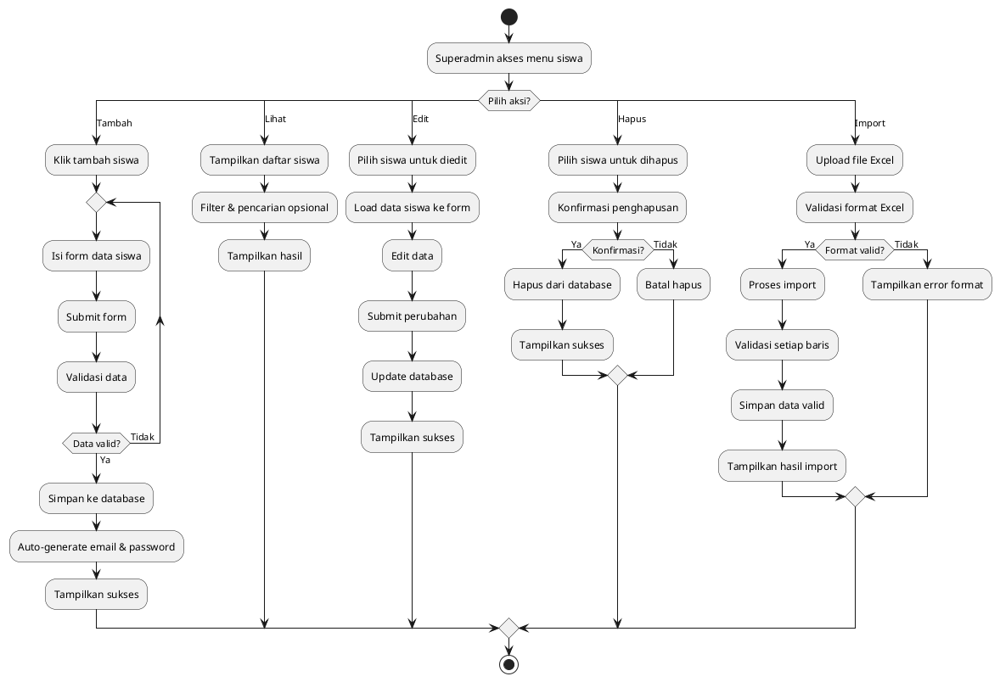
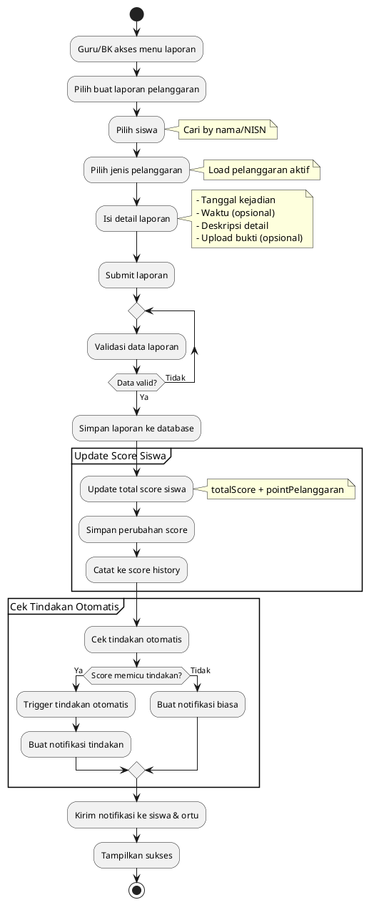
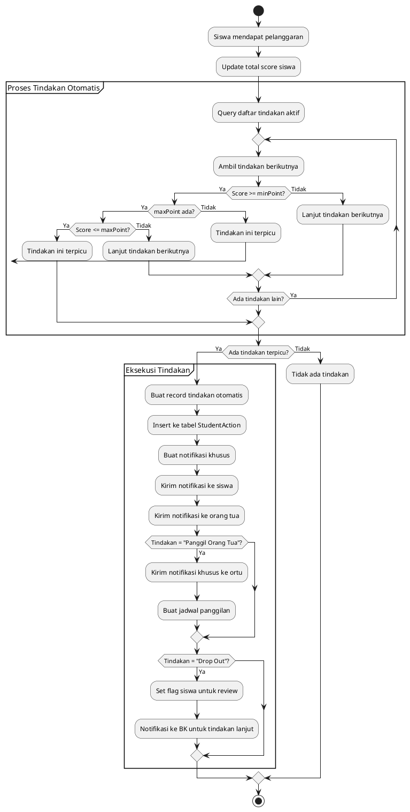
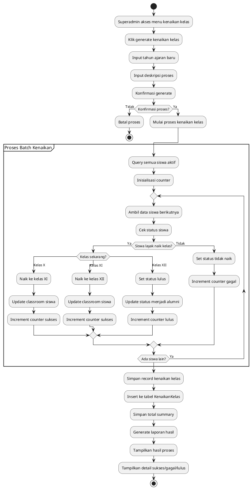
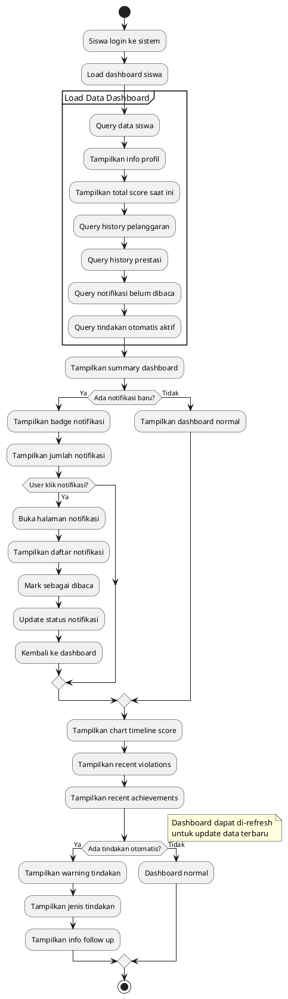
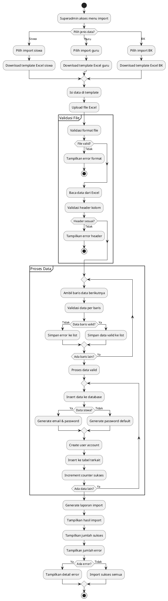
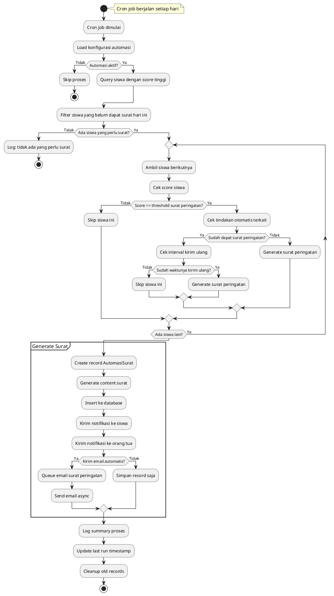
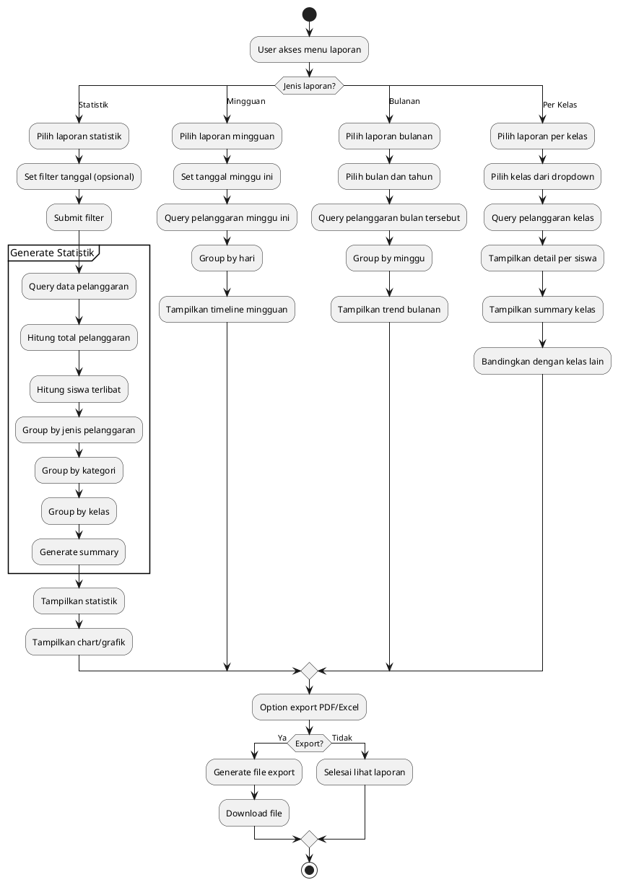
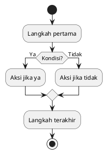

# 📊 PlantUML Activity Diagrams - Sistem Kesiswaan SMK14

## 📋 Cara Menggunakan File Ini
File ini berisi diagram dalam format PlantUML yang dapat di-render menggunakan:
- VS Code dengan extension PlantUML
- Online PlantUML Editor (plantuml.com)
- IntelliJ IDEA dengan PlantUML plugin

---

## 1. Login Multi-Role System

```plantuml
@startuml Login_MultiRole
start

:User mengakses halaman login;

if (Jenis User?) then (Siswa)
  :Masukkan NISN & Password;
  :Validasi kredensial siswa;
elseif (Guru/BK/Superadmin/Orang Tua) then
  :Masukkan Email & Password;
  :Validasi kredensial email;
endif

if (Kredensial valid?) then (Ya)
  :Generate JWT Token;
  :Set user session;
  
  switch (Role user?)
  case (Siswa)
    :Redirect ke dashboard siswa;
  case (Guru)
    :Redirect ke dashboard guru;
  case (BK)
    :Redirect ke dashboard BK;
  case (Superadmin)
    :Redirect ke dashboard admin;
  case (Orang Tua)
    :Redirect ke dashboard orang tua;
  endswitch
else (Tidak)
  :Tampilkan pesan error;
  :User mencoba login lagi;
  backward :Kembali ke form login;
endif

stop
@enduml
```

---

## 2. Manajemen Siswa (CRUD)



---

## 3. Laporan Pelanggaran Siswa



---

## 4. Sistem Tindakan Otomatis



---

## 5. Generate Kenaikan Kelas



---

## 6. Dashboard Siswa



---

## 7. Import Data dari Excel



---

## 8. Automasi Cron Job Surat Peringatan



---

## 9. Sistem Laporan & Statistik



---

## 📋 Summary Diagram PlantUML

### Keuntungan Menggunakan PlantUML:
1. **Sintaks yang Mudah**: Text-based diagram yang mudah di-maintain
2. **Version Control**: Dapat di-track di Git sebagai text
3. **Konsistensi**: Style yang seragam untuk semua diagram
4. **Integrasi**: Mudah diintegrasikan dengan dokumentasi
5. **Export**: Dapat di-export ke berbagai format (PNG, SVG, PDF)

### Cara Render Diagram:
1. **VS Code**: Install extension "PlantUML" 
2. **Online**: Buka plantuml.com dan paste code
3. **CLI**: Install plantuml dan jalankan `plantuml filename.puml`

### Template untuk Diagram Tambahan:


Semua diagram di atas dapat langsung digunakan dan dimodifikasi sesuai kebutuhan pengembangan aplikasi SMK14.