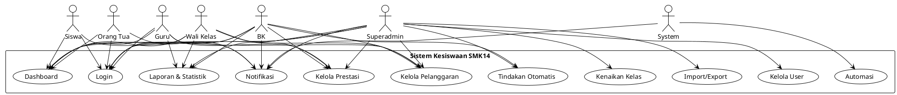
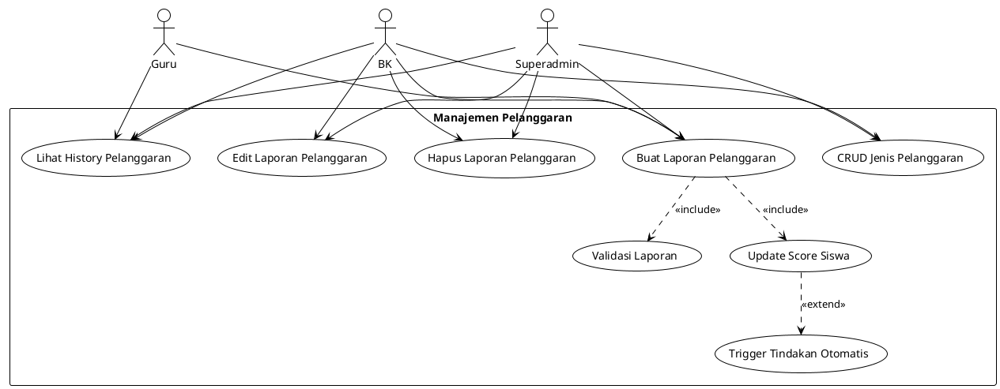
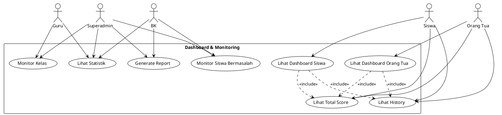

# 🎭 Use Case Diagrams - Sistem Kesiswaan SMK14

## 📋 Daftar Isi
1. [Overview Sistem](#overview-sistem)
2. [Use Case per Actor](#use-case-per-actor)
3. [Use Case Diagrams](#use-case-diagrams)
4. [Detail Use Cases](#detail-use-cases)

---

## Overview Sistem

### Actors (Pengguna Sistem):
1. **Siswa** - Melihat data diri, pelanggaran, prestasi, dan notifikasi
2. **Orang Tua** - Monitor kondisi anak, menerima notifikasi
3. **Guru** - Melaporkan pelanggaran dan prestasi siswa
4. **Wali Kelas** - Semua akses guru + monitoring kelas
5. **BK (Bimbingan Konseling)** - Mengelola pelanggaran, prestasi, dan tindakan
6. **Superadmin** - Full access untuk konfigurasi sistem
7. **System (Cron Jobs)** - Automasi sistem

---

## Use Case per Actor

### 👨‍🎓 Siswa
- Login dengan NISN
- Lihat Dashboard Pribadi
- Lihat History Pelanggaran
- Lihat History Prestasi
- Lihat Total Score
- Lihat Notifikasi
- Mark Notifikasi sebagai Dibaca
- Update Profil (terbatas)

### 👪 Orang Tua  
- Login dengan Email
- Lihat Dashboard Anak
- Monitor Kondisi Anak
- Lihat History Pelanggaran Anak
- Lihat History Prestasi Anak
- Terima Notifikasi Tindakan
- Konfirmasi Panggilan Orang Tua

### 👨‍🏫 Guru
- Login dengan Email
- Buat Laporan Pelanggaran
- Buat Laporan Prestasi
- Kelola Jenis Prestasi
- Lihat Data Siswa
- Lihat Statistik Dasar

### 👨‍🏫 Wali Kelas (extends Guru)
- Semua akses Guru
- Monitor Siswa di Kelas
- Lihat Laporan Kelas
- Export Data Kelas

### 👨‍💼 BK (Bimbingan Konseling)
- Login dengan Email
- Kelola Jenis Pelanggaran
- Kelola Jenis Prestasi
- Edit/Hapus Laporan Pelanggaran
- Edit/Hapus Laporan Prestasi
- Kelola Tindakan Otomatis
- Monitor Siswa Bermasalah
- Lihat Laporan & Statistik Lengkap
- Follow Up Tindakan

### 👑 Superadmin
- Login dengan Email
- Kelola User (CRUD)
- Kelola Siswa
- Kelola Guru & BK
- Kelola Orang Tua
- Kelola Kelas & Angkatan
- Kelola Jurusan
- Generate Kenaikan Kelas
- Import/Export Data
- Konfigurasi Sistem
- Akses Semua Laporan

### 🤖 System (Cron Jobs)
- Automasi Surat Peringatan
- Cleanup Data Lama
- Recalculate Scores
- Generate Report Harian

---

## Use Case Diagrams

### 1. Use Case Diagram - Overview Sistem

### 2. Use Case Diagram - Manajemen Pelanggaran

### 3. Use Case Diagram - Dashboard & Monitoring

---

## Detail Use Cases

### UC001: Login Sistem

**Actor**: Semua User  
**Precondition**: User memiliki akun aktif  
**Main Flow**:
1. User mengakses halaman login
2. System menampilkan form login
3. User memasukkan kredensial (NISN/Email + Password)
4. System validasi kredensial
5. System generate JWT token
6. System redirect ke dashboard sesuai role

**Alternative Flow**:
- 4a. Kredensial salah → System tampilkan error
- 4b. Account non-aktif → System tampilkan pesan

**Postcondition**: User berhasil login dan di dashboard

---

### UC002: Buat Laporan Pelanggaran

**Actor**: Guru, BK  
**Precondition**: User sudah login, siswa ada di sistem  
**Main Flow**:
1. User akses menu laporan pelanggaran
2. User pilih siswa
3. User pilih jenis pelanggaran
4. User isi detail laporan
5. System validasi data
6. System simpan laporan
7. System update score siswa
8. System cek trigger tindakan otomatis
9. System kirim notifikasi

**Alternative Flow**:
- 5a. Data tidak valid → System tampilkan error
- 8a. Score trigger tindakan → System jalankan tindakan otomatis

**Postcondition**: Laporan tersimpan, score terupdate, notifikasi terkirim

---

### UC003: Generate Kenaikan Kelas

**Actor**: Superadmin  
**Precondition**: Superadmin login, ada siswa aktif  
**Main Flow**:
1. Superadmin akses menu kenaikan kelas
2. Input tahun ajaran dan deskripsi
3. Konfirmasi generate
4. System proses semua siswa
5. System tentukan status naik/tidak naik/lulus
6. System update kelas siswa
7. System generate laporan hasil

**Alternative Flow**:
- 4a. Tidak ada siswa → System tampilkan pesan
- 5a. Siswa tidak layak → Set status tidak naik

**Postcondition**: Proses kenaikan kelas selesai, laporan tersedia

---

### UC004: Automasi Surat Peringatan

**Actor**: System (Cron Job)  
**Precondition**: Konfigurasi automasi aktif  
**Main Flow**:
1. Cron job berjalan setiap hari
2. System load konfigurasi automasi
3. System query siswa dengan score tinggi
4. System filter siswa yang perlu surat
5. System generate surat peringatan
6. System simpan record automasi
7. System kirim notifikasi dan email

**Alternative Flow**:
- 2a. Automasi non-aktif → Skip proses
- 4a. Tidak ada siswa → Log dan selesai

**Postcondition**: Surat peringatan otomatis terkirim

---

### UC005: Monitor Siswa Bermasalah

**Actor**: BK, Superadmin  
**Precondition**: User sudah login  
**Main Flow**:
1. User akses menu monitoring
2. System tampilkan daftar siswa dengan score tinggi
3. User filter berdasarkan kriteria
4. User pilih siswa untuk detail
5. System tampilkan history lengkap
6. User buat catatan follow up

**Alternative Flow**:
- 3a. Filter kosong → Tampilkan semua
- 6a. Reset score → User konfirmasi dan system update

**Postcondition**: Monitoring selesai, follow up tercatat

---

### UC006: Import Data Excel

**Actor**: Superadmin  
**Precondition**: Superadmin login, file Excel siap  
**Main Flow**:
1. Superadmin akses menu import
2. Pilih jenis data (siswa/guru/BK)
3. Download template Excel
4. Upload file yang sudah diisi
5. System validasi format dan data
6. System proses import batch
7. System generate laporan hasil

**Alternative Flow**:
- 5a. Format salah → System tampilkan error
- 5b. Ada data invalid → System skip dan catat error

**Postcondition**: Data berhasil diimport, laporan tersedia

---

## 🔗 Relationship Matrix

### Actor vs Use Case Matrix:

| Use Case | Siswa | Orang Tua | Guru | Wali Kelas | BK | Superadmin |
|----------|-------|-----------|------|------------|-----|------------|
| Login | ✅ | ✅ | ✅ | ✅ | ✅ | ✅ |
| Dashboard | ✅ | ✅ | ✅ | ✅ | ✅ | ✅ |
| Laporan Pelanggaran | ❌ | ❌ | ✅ | ✅ | ✅ | ✅ |
| Laporan Prestasi | ❌ | ❌ | ✅ | ✅ | ✅ | ✅ |
| CRUD Pelanggaran | ❌ | ❌ | ❌ | ❌ | ✅ | ✅ |
| CRUD User | ❌ | ❌ | ❌ | ❌ | ❌ | ✅ |
| Kenaikan Kelas | ❌ | ❌ | ❌ | ❌ | ❌ | ✅ |
| Import/Export | ❌ | ❌ | ❌ | ❌ | ❌ | ✅ |
| Tindakan Otomatis | ❌ | ❌ | ❌ | ❌ | ✅ | ✅ |
| Monitor Siswa | ❌ | ❌ | ❌ | ✅ | ✅ | ✅ |

### Key:
- ✅ Full Access
- ❌ No Access

---

## 📊 Use Case Priority

### High Priority (Must Have):
1. **UC001**: Login Sistem
2. **UC002**: Buat Laporan Pelanggaran  
3. **UC003**: Dashboard & Monitoring
4. **UC004**: Kelola User
5. **UC005**: Notifikasi

### Medium Priority (Should Have):
1. **UC006**: Laporan Prestasi
2. **UC007**: Tindakan Otomatis
3. **UC008**: Statistik & Report
4. **UC009**: Import/Export Data

### Low Priority (Nice to Have):
1. **UC010**: Kenaikan Kelas Otomatis
2. **UC011**: Automasi Cron Jobs
3. **UC012**: Advanced Analytics

Semua use case ini mendukung activity diagram yang telah dibuat sebelumnya dan memberikan gambaran lengkap tentang fungsionalitas sistem SMK14.